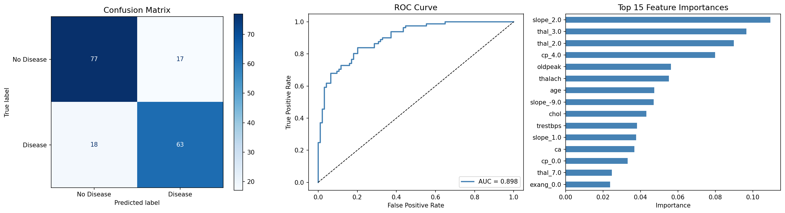
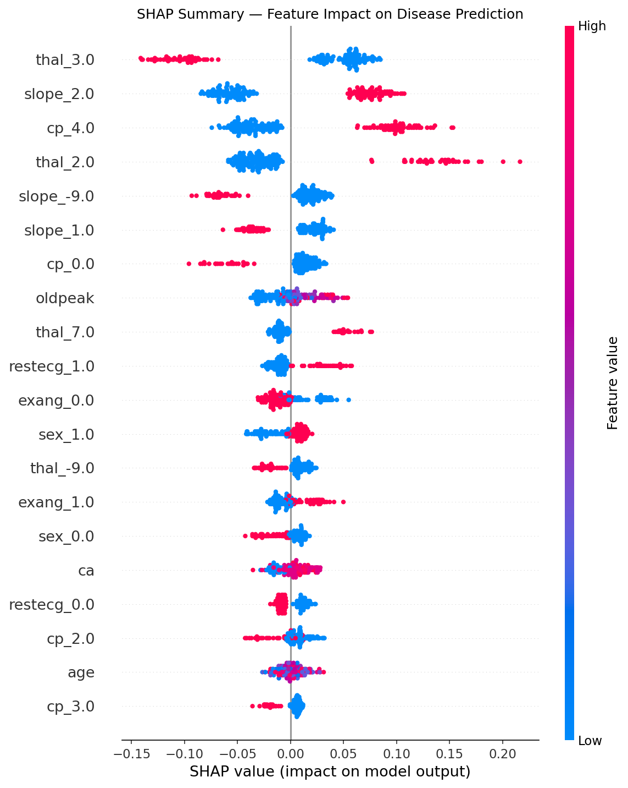
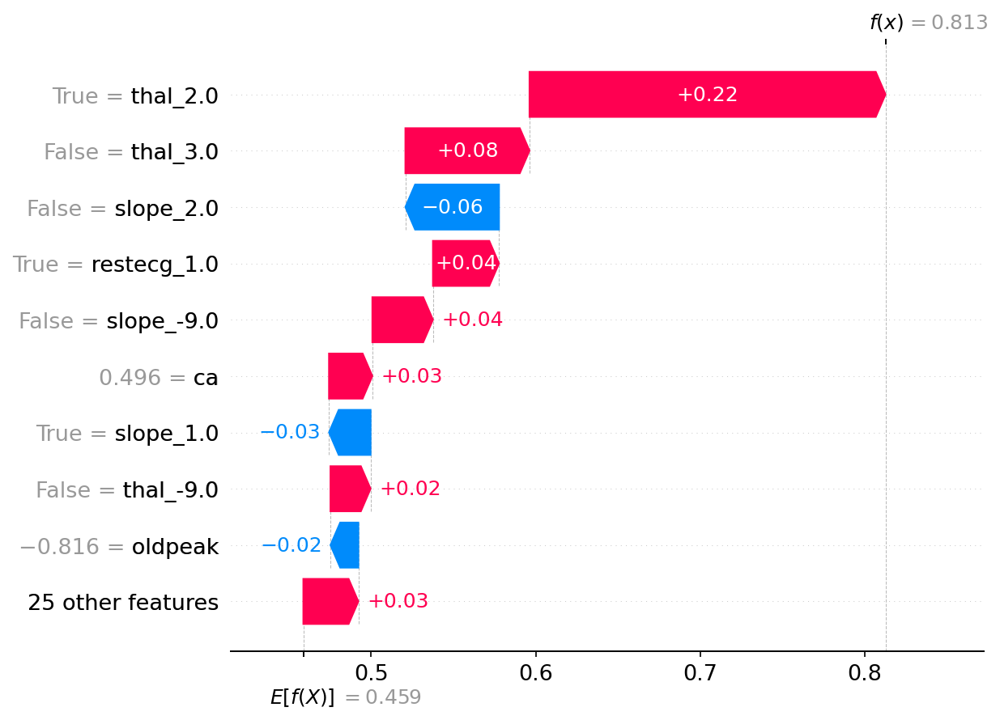

# 🫀 CardioSense — AI-Powered Heart Risk Predictor

<div align="center">


[](https://your-vercel-url.vercel.app)
[](https://your-render-url.onrender.com)
[](LICENSE)
[](https://python.org)
[](https://reactjs.org)

**Early cardiac risk detection powered by Machine Learning, SHAP explainability, and a clinical-grade recommendation engine.**

*Because a heart attack doesn't give you a warning — but CardioSense does.*

</div>

---

## 🌍 Why CardioSense?

> According to the **World Health Organization**, cardiovascular diseases kill **19.8 million people every year** — 85% of those deaths are from heart attacks and strokes. Over **38% of premature deaths** (under age 70) from non-communicable diseases are caused by CVDs. The majority happen in low- and middle-income countries where early detection tools are scarce.

CardioSense was built to change that. It gives anyone — regardless of access to specialists — a clinically-informed, AI-powered risk assessment based on their real health data, with actionable, prioritized recommendations to reduce that risk.

---

## ✨ Features

| Feature | Description |
|---|---|
| 🎯 **Risk Score** | Probability-based heart disease risk score (0–100%) |
| 🚦 **Risk Level** | Classified as Healthy, Warning, or Critical |
| 🧠 **SHAP Explainability** | Waterfall, Bar, and Force plots — so you know *why* you're at risk |
| 💊 **Recommendation Engine** | Prioritized clinical advice (High / Medium / Low) per risk factor |
| 📈 **Trend Dashboard** | Track your risk score over time with interactive Recharts visualizations |
| 👤 **User Accounts** | Persistent medical history stored per user via Supabase |
| 🌙 **Glassmorphism UI** | Sleek dark mode with frosted glass effects and smooth animations |
| ⚡ **Real-time Inference** | FastAPI backend delivers predictions in milliseconds |

---

## 🖥️ Screenshots


<div align="center">
  
  <p><i><b>Risk Dashboard:</b> Dynamic score gauge, SHAP waterfall explanation, and longitudinal trend lines.</i></p>
  <br>
  
  <p><i><b>Actionable Guidance:</b> Tiered clinical recommendations with priority flags for patient safety.</i></p>
  <br>
  
  <p><i><b>Risk Trend:</b> Because health isn't a snapshot—it’s a trajectory. This tracking module empowers users to monitor their heart health progress, ensuring that early warnings are caught and acted upon before they become emergencies.</i></p>
</div>

---

## 🤖 Model Performance

CardioSense uses a **Tuned Random Forest** trained on a combined clinical dataset of ~875 patient records from 3 validated sources.

| Metric | Score |
|---|---|
| **Accuracy** | 80.0% |
| **ROC-AUC** | **0.898** |
| **Top Predictors** | `oldpeak`, `thal`, `ca`, `cp`, `thalach` |

The model was benchmarked against Logistic Regression, SVM, Gradient Boosting, and XGBoost. Random Forest achieved the best ROC-AUC after hyperparameter tuning with `GridSearchCV`.

### Model Evaluation Plots

| Confusion Matrix + ROC Curve | SHAP Summary | SHAP Waterfall |
|:---:|:---:|:---:|
|  |  |  |
---

## 🧠 How SHAP Explainability Works

Every prediction in CardioSense comes with a full SHAP explanation — not just a number. This answers the most important question: **why is this person at risk?**

- **Waterfall chart** — shows each feature's contribution pushing the score up or down for a specific patient
- **Bar chart** — global feature importance across all predictions
- **Force plot** — the "push and pull" of medical metrics on the final risk score


This is what separates CardioSense from a black-box classifier. Patients and clinicians can see exactly which factors are driving the risk.

---

## 🏥 Datasets Used

| Dataset | Source | Rows |
|---|---|---|
| UCI Cleveland Heart Disease | UC Irvine ML Repository | 303 |
| Hungarian Heart Disease | UC Irvine ML Repository | 294 |
| Kaggle Heart Disease (heart.csv) | Kaggle / johnsmith88 | ~303 |
| Framingham Heart Study | Kaggle / Ashish Bhardwaj | Long-term risk insights |
| **Combined & Deduplicated** | — | **~875** |

---

## 🛠️ Tech Stack

### Frontend
- **React 18 + Vite** — fast, modern build tooling
- **Vanilla CSS with Glassmorphism** — custom dark mode design system, no UI library dependency
- **Framer Motion** — buttery-smooth multi-step form animations
- **Recharts** — interactive trend dashboard and risk history charts
- **Deployed on Vercel**

### Backend
- **FastAPI (Python)** — async, high-performance REST API
- **Scikit-learn** — Random Forest model inference
- **SHAP** — real-time explainability generation per prediction
- **Supabase (PostgreSQL)** — production database for user history
- **SQLite** — local development fallback
- **Deployed on Render**

### ML Pipeline
- **Pandas + NumPy** — data cleaning and feature engineering
- **Scikit-learn** — preprocessing pipeline, model training, cross-validation
- **XGBoost / Gradient Boosting / SVM** — benchmark comparisons
- **SHAP** — TreeExplainer for feature attribution

---

## 🚀 Getting Started

### Prerequisites
- Python 3.10+
- Node.js 18+
- A Supabase account (or use SQLite locally)

### 1. Clone the repository

```bash
git clone https://github.com/dakeshav2028/CardioSense.git
cd CardioSense
```

### 2. Backend setup

```bash
cd heart_diseases

# Create virtual environment
python -m venv venv
source venv/bin/activate        # Windows: venv\Scripts\activate

# Install dependencies
pip install -r requirements.txt

# Set environment variables
cp .env.example .env
# Edit .env with your Supabase credentials

# Run the API
uvicorn app:app --reload
```

API will be running at `http://localhost:8000`

### 3. Frontend setup

```bash
cd frontend

# Install dependencies
npm install

# Set environment variable
echo "VITE_API_URL=http://localhost:8000" > .env.local

# Start development server
npm run dev
```

Frontend will be running at `http://localhost:5173`

---

## 📡 API Reference

### `POST /predict`

Accepts patient health data and returns risk score, level, SHAP values, and recommendations.

**Request body:**
```json
{
  "age": 52,
  "sex": 1,
  "cp": 2,
  "trestbps": 140,
  "chol": 250,
  "fbs": 0,
  "restecg": 1,
  "thalach": 155,
  "exang": 0,
  "oldpeak": 1.5,
  "slope": 2,
  "ca": 1,
  "thal": 3
}
```

**Response:**
```json
{
  "risk_score": 81.3,
  "risk_level": "Critical",
  "alert": "Your risk score is critically high. Please consult a cardiologist immediately.",
  "recommendations": [
    { "priority": "High", "factor": "Blood Pressure", "advice": "Reduce sodium intake..." },
    { "priority": "Medium", "factor": "Heart Rate", "advice": "Gradually increase aerobic activity..." }
  ],
  "shap_values": { ... }
}
```

### `GET /history/{user_id}`

Returns a user's historical risk assessments for trend tracking.

### `GET /health`

API health check endpoint.

---

## 📁 Project Structure

```
CardioSense/
│
├── heart_diseases/              # Backend
│   ├── app.py                   # FastAPI application
│   ├── model/
│   │   ├── random_forest.pkl    # Trained model
│   │   └── scaler.pkl           # StandardScaler
│   ├── data/
│   │   └── cleaned_combined.csv
│   ├── notebooks/
│   │   ├── phase2_eda_preprocessing.ipynb
│   │   └── phase3_model_training.ipynb
│   └── requirements.txt
│
├── frontend/                    # React + Vite
│   ├── src/
│   │   ├── components/
│   │   ├── pages/
│   │   └── App.jsx
│   ├── package.json
│   └── vite.config.js
│
└── README.md
```

---

## 🧩 Recommendation Engine Logic

The recommendation engine is a **rule-based clinical advisor** built on WHO-validated intervention guidelines. Every prediction triggers a set of prioritized recommendations based on which risk factors are elevated.

| Risk Factor | Trigger Condition | Priority |
|---|---|---|
| Blood Pressure | `trestbps > 140` | High |
| Cholesterol | `chol > 240` | High |
| Exercise Angina | `exang == 1` | High |
| ST Depression | `oldpeak > 2.0` | High |
| Heart Rate | `thalach < 100` | Medium |
| Age | `age > 50` | Low |

If the risk score exceeds **80%**, the engine overrides all recommendations and triggers an **immediate cardiologist alert**.

---

## ⚠️ Medical Disclaimer

CardioSense is an educational and informational tool. It is **not a medical device** and does **not provide medical diagnosis**. All predictions are based on statistical models trained on historical data and should not replace consultation with a qualified cardiologist or physician.

If you experience chest pain, shortness of breath, or any cardiac symptoms — **seek emergency medical care immediately**.

---


## 📚 References

- [WHO Cardiovascular Disease Fact Sheet (2025)](https://www.who.int/en/news-room/fact-sheets/detail/cardiovascular-diseases-(cvds))
- [UCI Heart Disease Dataset](https://archive.ics.uci.edu/dataset/45/heart+disease)
- [Framingham Heart Study](https://www.kaggle.com/datasets/amanajmera1/framingham-heart-study-dataset)
- [SHAP Documentation](https://shap.readthedocs.io/en/latest/)
- [Scikit-learn Documentation](https://scikit-learn.org/stable/)

---

## 👨‍💻 Author

**Keshav Sarda** — built CardioSense from scratch as a full-stack ML project to address the rising early-age cardiac mortality crisis.

[](https://github.com/dakeshav2028)

---

<div align="center">

**If CardioSense helped you or inspired you — give it a ⭐ on GitHub.**

*Built with purpose. Because prevention is better than cure.*

</div>
